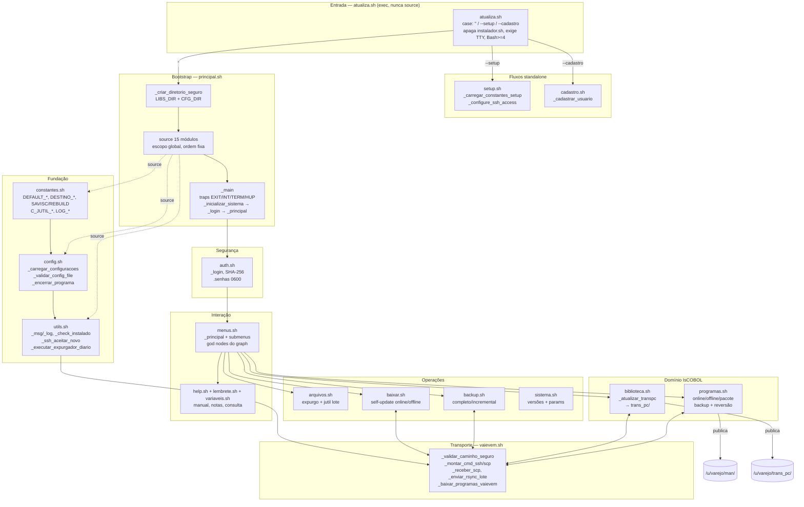

# ARCHITECTURE — Sistema SAV `Atualiza`

> Fonte: knowledge graph GitNexus (`Atualiza`: 30 arquivos, 74 símbolos, 66 relacionamentos)
> + análise estática dos módulos `binarios/` + `graphify-out/GRAPH_REPORT.md` (303 nós, 631 arestas, 20 comunidades).
>
> **Nota de proveniência (honestidade do graph):**
> `gitnexus://repo/Atualiza/context` OK; `clusters` e `processes` retornam **vazios**
> (`modules: []`, `processes: []` — 0 execution flows no índice).
> `query()` retorna vazio (FTS degradado no Windows) e `cypher` só expõe arestas
> `CONTAINS` (File→File, Doc→Seção). Ou seja: **não há top-5 processos no graph para
> traçar via `process/{name}`**. Os fluxos abaixo foram reconstruídos por leitura
> direta de `atualiza.sh`, `principal.sh`, `menus.sh`, `auth.sh` e da ordem fixa
> `MODULOS_CARREGAR`, validados contra o relatório graphify (comunidades por módulo).

## 1. Visão geral

Utilitário CLI em **Bash puro (4.0+, sem frameworks)** para gerenciar o ciclo de vida de
programas **IsCOBOL/ISAM** em servidores legados (Ubuntu 10.04/12.04, OpenSSH 5.x).
Compatibilidade > elegância (`sem declare -g`, `sem wait -n`, `umask 077`,
`set -euo pipefail` em todos os módulos).

Três entry points, um binário lógico:

```
./atualiza.sh               → executa  binarios/principal.sh  (operação normal)
./atualiza.sh --setup [--edit] → executa binarios/setup.sh   (configuração inicial)
./atualiza.sh --cadastro    → executa binarios/cadastro.sh   (usuários standalone)
```

`atualiza.sh` **executa** (nunca `source`) o alvo via bloco `case`; apaga
`instalador.sh` se existir; exige TTY ou pipe; exige Bash ≥ 4.

`principal.sh` é o verdadeiro bootstrap: cria dirs, faz `source` dos 15 módulos
**em escopo global e ordem fixa**, depois roda `_main`.

## 2. Áreas funcionais

| # | Área | Módulo(s) | Responsabilidade |
|---|------|-----------|------------------|
| 0 | Entry / Bootstrap | `atualiza.sh`, `principal.sh` | `case` de args, `SCRIPT_DIR/PLIBS_DIR`, `_criar_diretorio_seguro`, `MODULOS_CARREGAR`, `_main`, `_inicializar_sistema`, traps `EXIT/INT/TERM/HUP` |
| 1 | Fundação | `constantes.sh`, `config.sh`, `utils.sh` | Defaults (`DEFAULT_*`, `DESTINO_*`, `SAVISC/REBUILD`, `C_JUTIL_*`), `_carregar_config_seguro`, `REGISTRO_VARIAVEIS`, `_encerrar_programa/_resetando/_limpeza_emergencia`, `_msg/_ok/_aviso/_erro/_log`, cores `tput`, `_check_instalado`, `_ssh_aceitar_novo`, `_executar_expurgador_diario` |
| 2 | Segurança / Identidade | `auth.sh`, `cadastro.sh`, `setup.sh` | `_login` (3 tentativas, SHA-256, `.senhas` 0600), `_cadastrar_usuario`, `_validar_config_file` antes de carregar `.config`, `_validar_ssh`, `_ssh_contexto` |
| 3 | Transporte | `vaievem.sh` (+ `utils.sh` SSH) | `_validar_caminho_seguro` (toda op. arquivo passa aqui), `_montar_cmd_ssh/scp`, `_receber_scp`, `_enviar_rsync(_lote)`, `_baixar_programas_vaievem`, `_baixar_biblioteca_sincroniza`, `_enviar_arquivo_multi`; `_ssh_aceitar_novo` em vez de `StrictHostKeyChecking` inline; fallback senha/sem chave |
| 4 | Domínio IsCOBOL | `programas.sh`, `biblioteca.sh` | Programas: online/offline/pacote, `_solicitar_programas_atualizacao` (limite 6), `_backup_programa_antigo`, `_processar_atualizacao_programas` (**restrição AGENTS.md: não alterar fluxo/saída/arquivos**), `_processar_reversao_programas`; Biblioteca: `_executar_atualizacao_biblioteca`, `_atualizar_transpc` → `DESTINO_BIBLIOTECA=/u/varejo/trans_pc/` |
| 5 | Operações de arquivo | `arquivos.sh`, `backup.sh`, `baixar.sh`, `sistema.sh` | `arquivos.sh`: expurgo, jutil/rebuild em lote (ondas de N jobs + `wait $pid`, `C_JUTIL_PARALELO=1` default), `_listar_logs`; `backup.sh`: completo/incremental/multi-padrão, `_enviar_backup_{servidor,rede,avulso}`; `baixar.sh`: self-update online/offline (`GITHUB_UPDATE_URL`), `_voltar_sh_anterior`; `sistema.sh`: versões Linux/IsCOBOL, parâmetros, `_manutencao_setup` |
| 6 | Interação | `menus.sh`, `help.sh`, `lembrete.sh`, `variaveis.sh` | `_principal` + submenus (god nodes graphify: `_ler_opcao_menu`, `_exibir_cabecalho_menu`, `_principal` com 14 arestas), ajuda `M/H/Q`, `manual.txt` paginado, lembrete/notas de entrada, `_consultar_variaveis` tabular |

Ordem de carga (`principal.sh:MODULOS_CARREGAR`) — dependência só para frente:
`constantes → config → utils → auth → lembrete → vaievem → sistema → baixar →
arquivos → backup → programas → biblioteca → help → variaveis → menus`.

Diretórios runtime (`constantes.sh`): `configuracoes/ (.config/.senhas/.versao)`,
`logs/`, `backups/{anterior,base}`, `biblioteca/{atual,anterior}`,
`programas/{atual,anterior}`, `enviar/`, destinos remotos `/u/varejo/man/`,
`/u/varejo/trans_pc/`, toolchain `${RAIZ}/savisc/iscobol/bin/` (`jutil`, `iscclient`).

## 3. Fluxos de execução principais

Como o graph não registra processos, os fluxos são os caminhos reais no código:

### F1 — Boot → Login → Menu (caminho feliz)
`atualiza.sh[""]` → `principal.sh` → dirs+`source` 15 módulos → `_main`
→ `_inicializar_sistema` (`_inicializar_sistema_variaveis` → `_carregar_configuracoes`
→ `_check_instalado` → `_configurar_ambiente` → `_executar_expurgador_diario`
→ `_validar_ssh`) → `_login` → `_mostrar_aviso`/`_mostrar_notas_iniciais`
→ `_principal` (loop) → `_finalizar_sistema`.

### F2 — Setup / Cadastro (standalone, sem menu)
`--setup` → `setup.sh` (`_carregar_constantes_setup`, `_configure_ssh_access`,
`_edit_setup`, escreve `.config` validado); `--cadastro` → `cadastro.sh` → `_cadastrar_usuario`.

### F3 — Atualizar Programa(s) (menus 1)
`_principal[1]` → `_solicitar_programas_atualizacao` (≤6) →
`_validar_pre_requisitos_atualizacao` → `_backup_programa_antigo` →
`{_atualizar_programa_online | _offline | _pacote}` via `vaievem.sh`
→ `_coletar_artefatos_atualizacao`/`_resolver_arquivo_compilado`
(`class`/`mclass`, `TEL`) → jutil `REBUILD` → publica em `DESTINO_SERVER`
→ `_processar_reversao_programas` se falhar.

### F4 — Biblioteca / Backup / Arquivos (menus 2–4)
Biblioteca → `_definir_variaveis_biblioteca` → `_baixar_biblioteca_sincroniza`
→ `_executar_atualizacao_biblioteca` → `trans_pc/`. Backup → `_executar_backup[_completo|_incremental|_multiplos_padroes]`
→ `_enviar_backup_{servidor,rede,avulso}` (`enviabackup`, `portalsav/`).
Arquivos → expurgo/`limpetmp`/`variosarquivos`/`indexar` → `_executar_jutil` em lote → `_listar_logs`.

### F5 — Self-update + Ferramentas (menu 5, `baixar.sh`/`sistema.sh`)
`_atualizar_online` (zip do GitHub → valida → `_voltar_sh_anterior` em rollback)
vs `_atualizar_offline` (pacote local `portalsav/Atualiza`); `_mostrar_versao_{iscobol,linux}`,
`_mostrar_parametros`, `_manutencao_setup`.

## 4. Diagrama de arquitetura



## 5. Limites conhecidos do índice (para re-gerar com fidelidade total)

- Rodar `gitnexus analyze --pdg` (ou ao menos re-`analyze`) para tentar extrair
  `CALLS` Bash → `processes`/`clusters`; hoje só há `CONTAINS`.
- Reparar FTS no Windows (`analyze --repair-fts` + VC++ Redist/OpenSSL 3) para `query()` voltar a rankear.
- `graphify-out/GRAPH_REPORT.md` (commit `c71442a2`) é a melhor aproximação atual das
  comunidades — 1 comunidade por módulo, hubs em `menus.sh`, sem ciclos de import.
