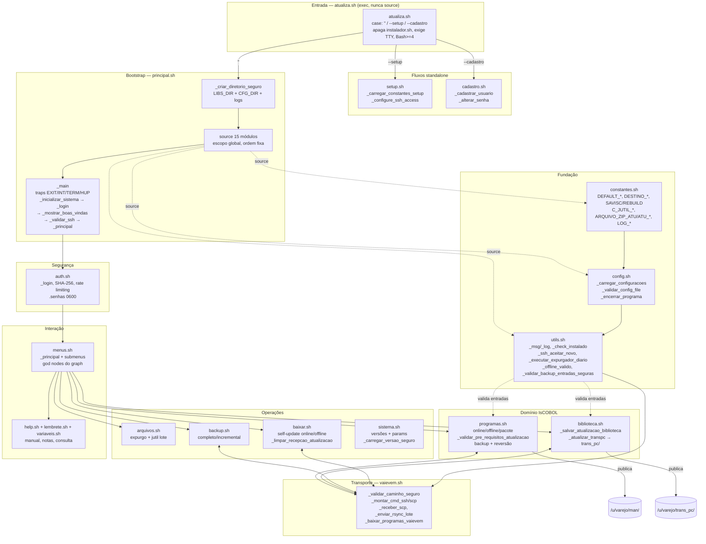

# ARCHITECTURE — Sistema SAV `Atualiza`

> Fonte: leitura direta dos módulos em `binarios/` + `atualiza.sh`/`principal.sh`, com
> apoio de `graphify-out/GRAPH_REPORT.md` (1 comunidade por módulo, hubs em `menus.sh`).
> As seções §5 e §6 (comportamento de extração e recepção compartilhada) vêm de
> **medição com os binários do alvo** (Info-ZIP `zip` 3.0 / `unzip` 6.00), não de leitura de código.
>
> **Nota de proveniência (honestidade do graph):**
> `gitnexus://repo/Atualiza/context` OK; `clusters` e `processes` retornam **vazios**
> (`modules: []`, `processes: []` — 0 execution flows no índice).
> `query()` retorna vazio (FTS degradado no Windows) e `cypher` só expõe arestas
> `CONTAINS` (File→File, Doc→Seção). Ou seja: **não há top-5 processos no graph para
> traçar via `process/{name}`**. Os fluxos abaixo foram reconstruídos por leitura
> direta do código e validados contra o relatório graphify.
> O índice (74 símbolos / 66 relacionamentos) é anterior aos commits `721c108`,
> `029be9b` e `ea2fe57` — não reflete o código atual.

## 1. Visão geral

Utilitário CLI em **Bash puro (4.0+, sem frameworks)** para gerenciar o ciclo de vida de
programas **IsCOBOL/ISAM** em servidores legados (Ubuntu 10.04/12.04, OpenSSH 5.x).
Compatibilidade > elegância (`sem declare -g`, `sem wait -n`, `umask 077`,
`set -euo pipefail` em todos os módulos).

Três entry points, um binário lógico:

```
./atualiza.sh                    → executa binarios/principal.sh  (operação normal)
./atualiza.sh --setup [--edit]   → executa binarios/setup.sh     (configuração inicial)
./atualiza.sh --cadastro         → executa binarios/cadastro.sh  (usuários standalone)
```

`atualiza.sh` **executa** (nunca `source`) o alvo via bloco `case`; apaga
`instalador.sh` se existir; exige TTY ou pipe; exige Bash ≥ 4.

`principal.sh` é o verdadeiro bootstrap: cria dirs, faz `source` dos 15 módulos
**em escopo global e ordem fixa**, depois roda `_main`.

## 2. Áreas funcionais

| # | Área | Módulo(s) | Responsabilidade |
|---|------|-----------|------------------|
| 0 | Entry / Bootstrap | `atualiza.sh`, `principal.sh` | `case` de args, `SCRIPT_DIR/LIBS_DIR`, `_criar_diretorio_seguro`, `MODULOS_CARREGAR`, `_main`, `_inicializar_sistema`, traps `EXIT/INT/TERM/HUP` |
| 1 | Fundação | `constantes.sh`, `config.sh`, `utils.sh` | Defaults (`DEFAULT_*`, `DESTINO_*`, `SAVISC/REBUILD`, `C_JUTIL_*`, bloco `ARQUIVO_ZIP_ATU`/`ATU_*`), `_carregar_config_seguro`, `REGISTRO_VARIAVEIS`, `_encerrar_programa/_resetando/_limpeza_emergencia`, `_msg/_ok/_aviso/_erro/_log`, cores `tput`, `_check_instalado`, `_ssh_aceitar_novo`, `_executar_expurgador_diario`, **helpers compartilhados `_offline_valido`/`_offline_erro` e `_validar_backup_entradas_seguras`** (§5) |
| 2 | Segurança / Identidade | `auth.sh`, `cadastro.sh`, `setup.sh` | `_login` (3 tentativas + rate limiting em `.tentativas_login`, hash `algoritmo$salt$hash` com salt, `.senhas` 0600), `_hash_senha`/`_hash_senha_simples` + allowlist de algoritmo, `_alterar_senha [usuario]`, `_cadastrar_usuario`, `_validar_config_file` antes de carregar `.config`, `_validar_ssh`, `_ssh_contexto` |
| 3 | Transporte | `vaievem.sh` (+ `utils.sh` SSH) | `_validar_caminho_seguro` (toda op. arquivo passa aqui), `_montar_cmd_ssh/scp`, `_receber_scp`, `_enviar_rsync(_lote)`, `_baixar_programas_vaievem`, `_baixar_biblioteca_sincroniza`, `_enviar_arquivo_multi`; `_ssh_aceitar_novo` em vez de `StrictHostKeyChecking` inline; fallback senha/sem chave |
| 4 | Domínio IsCOBOL | `programas.sh`, `biblioteca.sh` | Programas: online/offline/pacote, `_solicitar_programas_atualizacao` (limite 6), `_validar_pre_requisitos_atualizacao` (**portão de pacote**, §5), `_backup_programa_antigo`, `_processar_atualizacao_programas` (**restrição AGENTS.md — com exceção registrada**, ver abaixo), `_processar_reversao_programas`; Biblioteca: `_salvar_atualizacao_biblioteca` (**portão único** dos 3 fluxos, §5), `_executar_atualizacao_biblioteca` → `trans_pc/` |
| 5 | Operações de arquivo | `arquivos.sh`, `backup.sh`, `baixar.sh`, `sistema.sh` | `arquivos.sh`: expurgo, jutil/rebuild em lote (ondas de N jobs + `wait $pid`, `C_JUTIL_PARALELO=1` default), `_listar_logs`; `backup.sh`: completo/incremental/multi-padrão, `_enviar_backup_{servidor,rede,avulso}`; `baixar.sh`: self-update online/offline (`GITHUB_UPDATE_URL`), `_limpar_recepcao_atualizacao` (§6), `_voltar_sh_anterior`; `sistema.sh`: versões Linux/IsCOBOL, `_carregar_versao_seguro` (whitelist + `^[0-9]+$`), `_manutencao_setup` |
| 6 | Interação | `menus.sh`, `help.sh`, `lembrete.sh`, `variaveis.sh` | `_principal` + submenus (god nodes graphify: `_ler_opcao_menu`, `_exibir_cabecalho_menu`, `_principal` com 14 arestas), ajuda `M/H/Q`, `manual.txt` paginado, lembrete/notas de entrada, `_consultar_variaveis` tabular |

Ordem de carga (`principal.sh:MODULOS_CARREGAR`) — dependência só para frente:
`constantes → config → utils → auth → lembrete → vaievem → sistema → baixar →
arquivos → backup → programas → biblioteca → help → variaveis → menus`.

> **Consequência prática:** helper usado por dois módulos mora no de **menor índice**
> de carga. `_validar_backup_entradas_seguras` morava em `backup.sh` e foi movida para
> `utils.sh` quando `programas.sh` (índice 11, depois de `backup.sh` no 10) passou a
> precisar dela. Mover preservou o nome, então nenhum call site mudou
> (`backup.sh` usa o alias `_validar_zip_entradas_seguras`).

Diretórios runtime (`constantes.sh`): `configuracoes/ (.config/.senhas/.versao)`,
`logs/`, `backups/{anterior,base}`, `biblioteca/{atual,anterior}`,
`programas/{atual,anterior}`, `enviar/`, destinos remotos `/u/varejo/man/`,
`/u/varejo/trans_pc/`, toolchain `${RAIZ}/savisc/iscobol/bin/` (`jutil`, `iscclient`).

## 3. Fluxos de execução principais

Como o graph não registra processos, os fluxos são os caminhos reais no código.

### F1 — Boot → Login → Menu (caminho feliz)
`atualiza.sh[""]` → `principal.sh` → dirs+`source` 15 módulos → `_main`
→ `_inicializar_sistema` (`_inicializar_sistema_variaveis` → `_carregar_configuracoes`
→ `_check_instalado` → `_configurar_ambiente` → `_executar_expurgador_diario`)
→ `_login` → `_mostrar_boas_vindas` → `_validar_ssh`
→ `_mostrar_aviso`/`_mostrar_notas_iniciais`
→ `_principal` (loop) → `_finalizar_sistema`.

### F2 — Setup / Cadastro (standalone, sem menu)
`--setup` → `setup.sh` (`_carregar_constantes_setup`, `_configure_ssh_access`,
`_edit_setup`, escreve `.config` validado); `--cadastro` → `cadastro.sh` → `_cadastrar_usuario`.

### F3 — Atualizar Programa(s) (menus 1)
`_principal[1]` → `_solicitar_programas_atualizacao` (≤6) →
`_atualizar_programa_{online|offline|pacote}` (cada um decide rede vs. local por
`CFG_OFFLINE`, §4) → download via `vaievem.sh` ou conferência em `CFG_PORTALSAV` →
`_processar_atualizacao_{programas|pacotes}`:
`_validar_pre_requisitos_atualizacao` (**inclui §5**) → cria `${CFG_PORTALSAV}/${ATU_DIR_TEMP}`
→ move os pacotes para lá → `_backup_programa_antigo` → `unzip -o` **dentro** do temporário
→ jutil `REBUILD` → publica em `DESTINO_SERVER` → `_processar_reversao_programas` se falhar.

### F4 — Biblioteca / Backup / Arquivos (menus 2–4)
Biblioteca → `_definir_variaveis_biblioteca` → download (`_baixar_biblioteca_sincroniza`)
ou conferência em `CFG_PORTALSAV` → **`_salvar_atualizacao_biblioteca`** (subshell; verifica
presença **e** §5 dos pacotes) → `_processar_atualizacao_biblioteca` (tar de backup) →
`_executar_atualizacao_biblioteca` (grava `VERSAOANT`, move `*.zip`→`*.bkp`) →
`unzip -o -d "${principal_local}"` → `trans_pc/`.
Backup → `_executar_backup[_completo|_incremental|_multiplos_padroes]` →
`_enviar_backup_{servidor,rede,avulso}` (`enviabackup`, `portalsav/`).
Arquivos → expurgo/`limpetmp`/`variosarquivos`/`indexar` → `_executar_jutil` em lote → `_listar_logs`.

### F5 — Self-update + Ferramentas (menu 5, `baixar.sh`/`sistema.sh`)
`_atualizar_online` (zip do GitHub → `<zip>.part` → promoção atômica → `_atualizando`)
vs `_atualizar_offline` (pacote local em `${CFG_PORTALSAV}/${ATU_DIR_TEMP}`).
`_atualizando`: `_coletar_backups` → localiza o ZIP → `unzip -t` → extrai com `-j` em
`$ATU_DIR_STAGING` → valida `bash -n` de tudo → instala → `_limpar_recepcao_atualizacao` (§6).
Rollback por `_voltar_sh_anterior`. Ferramentas: `_mostrar_versao_{iscobol,linux}`,
`_mostrar_parametros` (lê `.versao`), `_manutencao_setup`.

## 4. `CFG_OFFLINE` — um valor, cinco comportamentos

`CFG_OFFLINE` vem de `Offline` no `.config` (`constantes.sh`), valor `s`/`n`. A validação é
`_offline_valido` (`utils.sh`), que aceita só `^[sn]$`. Sem ela, cada módulo testava por
conta própria e errava de um jeito — as duas falhas concretas, já corrigidas:

| Call site | Antes (valor vazio/`S`/lixo) | Agora |
|---|---|---|
| `baixar.sh:_executar_update` | erro explícito (`case`) | `_erro` + `rc=1` |
| `biblioteca.sh:_atualizar_transpc` | pulava o aviso **e a checagem de espaço**, caía em `_baixar_biblioteca_sincroniza` → **rede** | aborta com mensagem |
| `biblioteca.sh:_atualizar_biblioteca_offline` | `if` sem `else` → função caía no fim e **retornava 0 sem fazer nada** | aborta com mensagem |
| `programas.sh:_atualizar_programa_pacote` | teste `-n && == "s"` falhava → `_baixar_pacotes_vaievem` → **rede** num menu usado por estar off-line | aborta com mensagem |
| `backup.sh:_enviar_backup_avulso` | `_aviso` e nenhuma ação | mantido (ali não agir é o certo) |
| `programas.sh:_atualizar_programa_online` | `== "s"` cru | mantido: cair no online é a intenção do menu |

## 5. Portões de validação de pacote — comportamento medido do extrator

`_validar_backup_entradas_seguras` (`utils.sh`) lista os membros (`unzip -Z1` / `tar -tzf`)
e rejeita `../`, caminho absoluto e `C:\`. **Por que é necessário depende do destino da
extração** — e aqui a diferença é medida, não presumida (Info-ZIP `zip` 3.0, `unzip` 6.00,
GNU `tar`):

| Invocação | Entrada `/etc/x` no ZIP | Entrada `../../x` | Escapa? |
|---|---|---|---|
| `unzip -o f.zip` (cwd = temporário) | vira `etc/x` **dentro** do cwd | `skipped "../" path component(s)` | **não** |
| `unzip -o f.zip -d /` | `stripped absolute path spec` e escreve em `/etc/x` | idem | **SIM** |
| `tar -xzf f.tar.gz` (cwd) | `Removing leading '/'` → relativo ao cwd | `Member name contains '..'` | **não** |
| `tar -xzf f.tar.gz -C /` | `Removing leading '/'` → recria o caminho sob `/` | idem | **SIM** |

O ponto: **o "strip" do `unzip` somado a `-d /` equivale a escrever no caminho absoluto.**
Por isso `biblioteca.sh` (que extrai com `-d "${principal_local}"`, e `principal_local` é `/`
em produção porque `RAIZ` termina em `/sav`) era um hole live; `programas.sh` (que extrai com
`unzip -o` dentro de `${CFG_PORTALSAV}/${ATU_DIR_TEMP}`) **não** era — o guard lá é defesa
em profundidade, útil porque `DEFAULT_UNZIP` é configurável pelo `.config`.

Portões hoje:

| Portão | Cobre | Estado |
|---|---|---|
| `biblioteca.sh:_salvar_atualizacao_biblioteca` | os 3 fluxos de update de biblioteca | adicionado em `ea2fe57` |
| `biblioteca.sh:_reverter_biblioteca_completa` / `:_reverter_programa_especifico_biblioteca` | reversão, extrai em `/` | pré-existente |
| `programas.sh:_validar_pre_requisitos_atualizacao` (`programas.sh:578`) | update de programas e de pacotes | adicionado em `029be9b` |

> **Restrição e exceção.** `AGENTS.md` proíbe alterar fluxo/saída/arquivos de
> `_processar_atualizacao_programas`. O guard de `programas.sh` foi adicionado **com
> autorização explícita** e com escopo delimitado: para ZIP legítimo o validador é
> silencioso e fluxo, saída e arquivos são idênticos; o comportamento só muda para ZIP com
> `../`/absoluto, que passavam a escrever fora do temporário.

## 6. `CFG_PORTALSAV` — recepção compartilhada

`CFG_PORTALSAV` (default `${RAIZ}/portalsav/atualiza`) **não é área de rascunho de uma
operação**. Quatro módulos depositam lá, em tempos diferentes:

| Quem escreve | O quê | Momento |
|---|---|---|
| `backup.sh:_mover_backup_offline` | backup `<empresa>_<tipo>_<base>_<data>.zip` | fica aguardando envio manual |
| `vaievem.sh` / `biblioteca.sh` | ZIP de biblioteca (`*_<VERSAO>.zip`) | entre o download e o processamento |
| `programas.sh:846` | `<programa>.zip` de reversão | durante a reversão |
| `baixar.sh` | `atualiza.zip` (ou `<zip>.part`) | durante o self-update |

Consequência: **nada pode fazer `rm -rf`/`find -exec rm` no topo desse diretório.** Era
exatamente o que `_limpar_recepcao_atualizacao` fazia no passo 4 (`find -mindepth 1
-maxdepth 1 -exec rm -rf {} +`) — apagava backup offline pendente, ZIP de biblioteca e ZIP
de reversão junto com o resíduo, e ainda imprimia "Diretorio limpo com sucesso". Isso foi
corrigido em `721c108`.

Agora a limpeza remove **só artefatos nominais**, e o que sobrar vai para o log:
1. `<ARQUIVO_ZIP_ATU>` na raiz (self-update online) e dentro de `${ATU_DIR_TEMP}` (offline);
2. `${ATU_DIR_STAGING}` e `${ATU_DIR_TEMP}` inteiros, com guarda contra `$dir == $CFG_PORTALSAV`;
3. `<ARQUIVO_ZIP_ATU><ATU_SUFFIXO_PARCIAL>` — o `.part` de download interrompido (o passo 4
   antigo era o que pegava esse resíduo);
4. **`find` apenas para *listar* o que sobrou** → `_log "AVISO: itens preservados..."`.

Os nomes derivados (`ATU_DIR_TEMP`, `ATU_DIR_STAGING`, `ARQUIVO_ZIP_ATU`,
`ATU_SUFFIXO_PARCIAL`) são validados como `^[A-Za-z0-9._-]+$` **antes** de qualquer remoção:
com `ATU_DIR_STAGING` vazio, `"${CFG_PORTALSAV}/${ATU_DIR_STAGING}"` resolveria para a
própria recepção e o `rm -rf` apagaria tudo.

`programas.sh` tira o nome do temporário da mesma constante (`${ATU_DIR_TEMP}`), não de um
literal repetido — se a constante mudar, os dois lados continuam alinhados.

## 7. Diagrama de arquitetura


```mermaid
flowchart TB
    subgraph Entry["Entrada — atualiza.sh (exec, nunca source)"]
        A[atualiza.sh<br/>case: '' / --setup / --cadastro<br/>apaga instalador.sh, exige TTY, Bash>=4]
    end

    subgraph Standalone["Fluxos standalone"]
        S[setup.sh<br/>_carregar_constantes_setup<br/>_configure_ssh_access]
        C[cadastro.sh<br/>_cadastrar_usuario<br/>_alterar_senha]
    end

    subgraph Bootstrap["Bootstrap — principal.sh"]
        P1[_criar_diretorio_seguro<br/>LIBS_DIR + CFG_DIR + logs]
        P2[source 15 módulos<br/>escopo global, ordem fixa]
        P3[_main<br/>traps EXIT/INT/TERM/HUP<br/>_inicializar_sistema → _login<br/>→ _mostrar_boas_vindas → _validar_ssh → _principal]
    end

    subgraph Fundacao["Fundação"]
        K[constantes.sh<br/>DEFAULT_*, DESTINO_*, SAVISC/REBUILD<br/>C_JUTIL_*, ARQUIVO_ZIP_ATU/ATU_*, LOG_*]
        CFG[config.sh<br/>_carregar_configuracoes<br/>_validar_config_file<br/>_encerrar_programa]
        U[utils.sh<br/>_msg/_log, _check_instalado<br/>_ssh_aceitar_novo, _executar_expurgador_diario<br/>_offline_valido, _validar_backup_entradas_seguras]
    end

    subgraph Seguranca["Segurança"]
        AUTH[auth.sh<br/>_login, SHA-256, rate limiting<br/>.senhas 0600]
    end

    subgraph Transporte["Transporte — vaievem.sh"]
        V[_validar_caminho_seguro<br/>_montar_cmd_ssh/scp<br/>_receber_scp, _enviar_rsync_lote<br/>_baixar_programas_vaievem]
    end

    subgraph Dominio["Domínio IsCOBOL"]
        PRG[programas.sh<br/>online/offline/pacote<br/>_validar_pre_requisitos_atualizacao<br/>backup + reversão]
        BIB[biblioteca.sh<br/>_salvar_atualizacao_biblioteca<br/>_atualizar_transpc → trans_pc/]
    end

    subgraph Ops["Operações"]
        ARQ[arquivos.sh<br/>expurgo + jutil lote]
        BKP[backup.sh<br/>completo/incremental]
        BX[baixar.sh<br/>self-update online/offline<br/>_limpar_recepcao_atualizacao]
        SIS[sistema.sh<br/>versões + params<br/>_carregar_versao_seguro]
    end

    subgraph UI["Interação"]
        M[menus.sh<br/>_principal + submenus<br/>god nodes do graph]
        H[help.sh + lembrete.sh + variaveis.sh<br/>manual, notas, consulta]
    end

    A -->|"''"| P1
    A -->|"--setup"| S
    A -->|"--cadastro"| C
    P1 --> P2 --> P3
    P2 -. source .-> K
    P2 -. source .-> CFG
    P2 -. source .-> U
    P3 --> AUTH --> M
    M --> PRG & BIB & BKP & ARQ & BX & H
    PRG <--> V
    BIB <--> V
    BKP <--> V
    BX <--> V
    PRG -->|publica| DEST1[(/u/varejo/man/)]
    BIB -->|publica| DEST2[(/u/varejo/trans_pc/)]
    K --> CFG --> U --> V
    U -.->|valida entradas| PRG
    U -.->|valida entradas| BIB
```

## 8. Cobertura de teste

Duas suítes, ambas sem TTY, ambas com `set -euo pipefail`:

| Suíte | Módulo | Checks |
|---|---|---|
| `testes/test_sistema.sh` | `sistema.sh` (source isolado) | 16 |
| `testes/test_auth.sh` | `auth.sh` (source isolado) | 63 |

Não há suíte para `utils.sh`, `programas.sh`, `biblioteca.sh`, `backup.sh` nem `baixar.sh`,
nem runner (`bats`/`trunk`). Mudança de segurança nesses módulos foi verificada com harness
descartável **rodado também contra `git show HEAD:<arquivo>`** — é isso que distingue
regressão real de teste que passa nos dois códigos. `test_sistema.sh` é o modelo para
adicionar um terceiro: `source` do módulo + stubs + `falhas` contador.

## 9. Limites conhecidos do índice (para re-gerar com fidelidade total)

- Rodar `gitnexus analyze --pdg` (ou ao menos re-`analyze`) para tentar extrair
  `CALLS` Bash → `processes`/`clusters`; hoje só há `CONTAINS`.
- Reparar FTS no Windows (`analyze --repair-fts` + VC++ Redist/OpenSSL 3) para `query()` voltar a rankear.
- `graphify-out/GRAPH_REPORT.md` é a melhor aproximação atual das comunidades —
  1 comunidade por módulo, hubs em `menus.sh`, sem ciclos de import.
- `README.md` **não** é fonte confiável: cita `move_dir.sh` (removido), um `docs/` inexistente,
  "20 scripts" em `binarios/` (são 18 `.sh`, 15 no `MODULOS_CARREGAR`) e três suítes que não
  existem. Este arquivo e `binarios/` são a referência.
